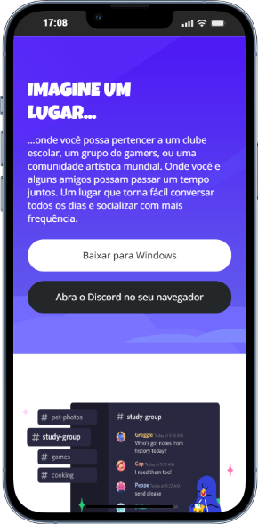
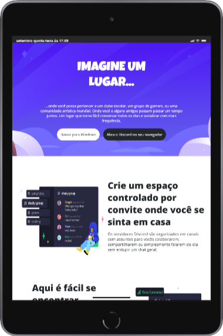
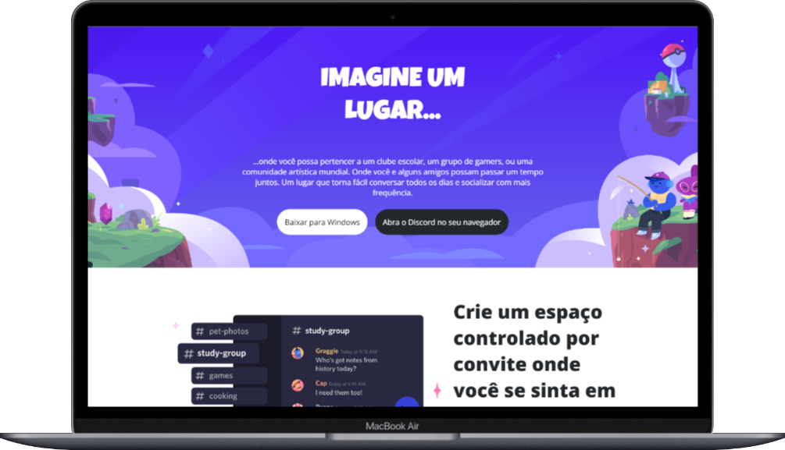

# 🎨 Desafio CSS - Página discord responsivo DIO 

Desafio tinha como objetivo de aplicar na prática os conceitos apresentados e aprendidos nas aulas de CSS sobre responsividade, posicionamento, organização e divisão de espaços dos elementos na página em diferentes telas de dispositivos. O tema do desafio consistia na clonagem da página do discord contento alguns elementos como: imagens, botões, textos, ícones e links.

## 🧰 Tecnologias Utilizadas
Todas as tecnologias utilizadas no projeto com suas respectivas versões.

| Tecnologias | Versões |
|-------------|---------|
| HTML        | 5       |
| CSS         | 3       |
| Git         | 2.46.0  |

📝 Processo de Desenvolvimento
- Começando o desenvolvimento escolhi primeiro a estruturar o HTML com tudo que precisava no site como todos os textos, imagens, links e ícones para depois mexer nos estilos.

- No CSS uma boa pratica para sites responsivos é começar o desenvolvimento pelas telas menores e depois as maiores, uma abordagem chamada de "Mobile first", assim facilitando na manutenção do site. As imagens e os layouts foram inspirados no figma disponibilizado pela professar para auxiliar no desenvolvimento do projeto. 
- [Link figma](https://www.figma.com/design/NRBYrG5d4DSzObv7dpTqoM/Desafio-Responsividade---DIO?node-id=1-2&t=8031V9aSoQJFNyoE-0)

- Depois comecei os estilos das telas maiores como as de tabletes e desktops que era as partes faltantes do site, além de alguns ajustes nos posicionamentos e tamanhos dos elementos nos novos layouts.

- Por fim me concentrei na organização do código e na documentação do projeto.

## 📷 Imagens do Desafio
Todas as imagens em diferentes dispositivos do projeto.

###  Tela Mobile

### Tela Tablet

### Tela Desktop

